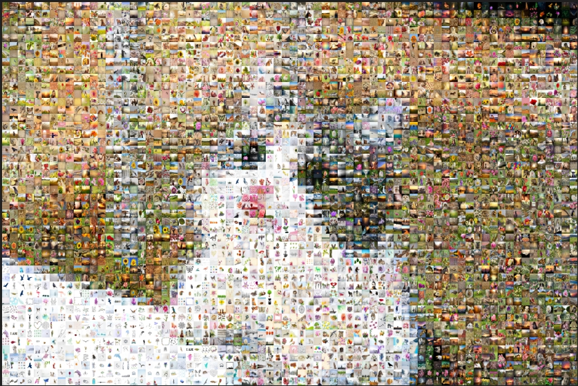

# Picture Merge

### Input


### Output



### Dependency
- python3.5 or later
- pipenv
    - Use `pipenv install` to install rest XD
- firefox
- geckodriver <a href='https://github.com/mozilla/geckodriver/releases'>Here</a>
    - Windows
        - geckodriver.exe
    - Linux
        - geckodriver 

### Usage

#### Config your setting


#### Fresh Start
Just find a picture\
Open `./config.json`

- `nscale`
    - Output size = Input size * `nscale`
    - Bigger is more beautiful but need more memory to open
- `mask_scale`
    - Input imgae mask size
- `past_size`
    - The element picture size

```
python3.6 main.py -I <original image>
```
##### `./record` file will be generator while is merging

### Continue from half work
```
python3.6 -o <half work image> -r <record file>
```
## Enjoy

